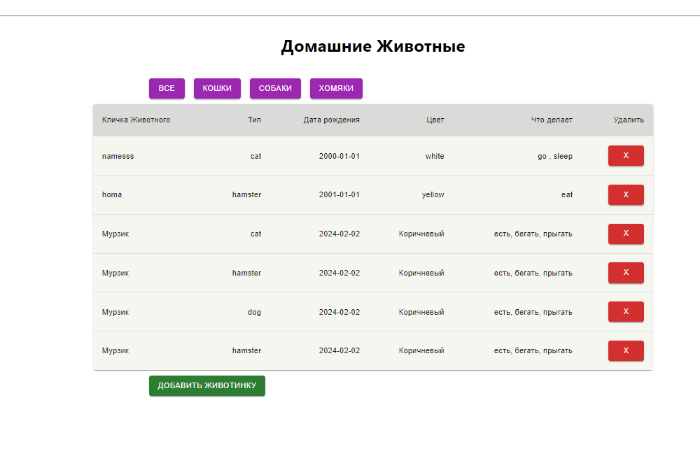
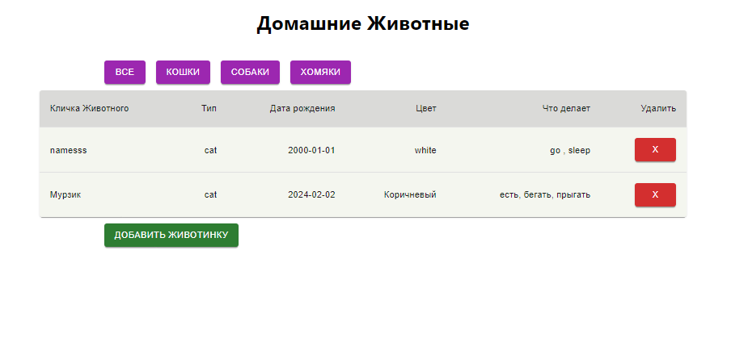
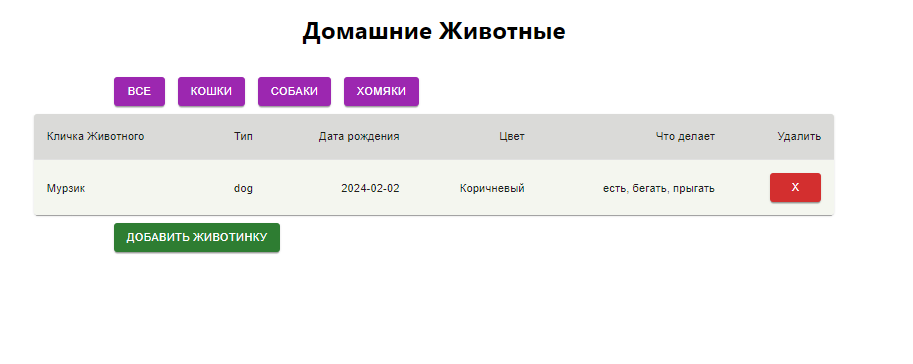
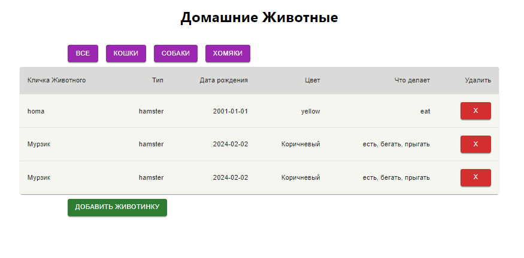
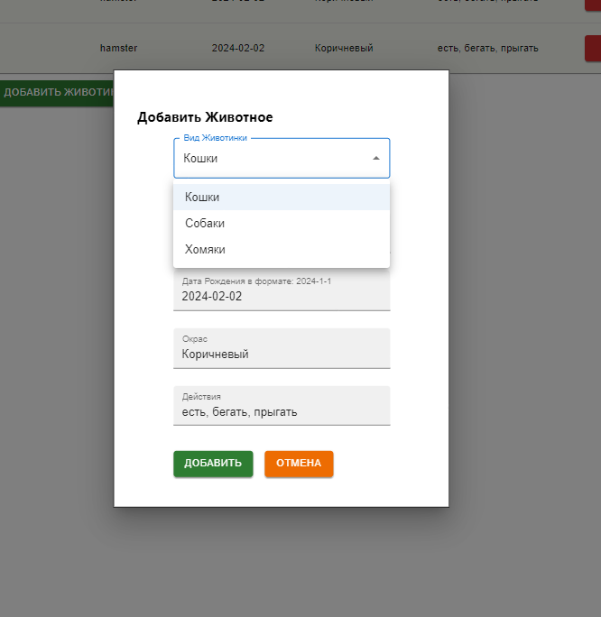
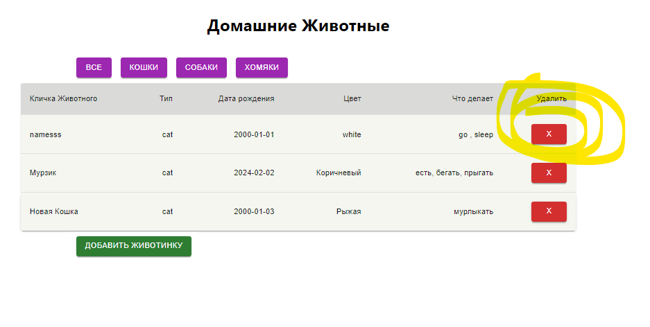

## Домашние животные 
### Ромашов Максим 2024 

Выполнение команд линукс и MySql см. lin_commands.doc

Выполнение программы:
1. 

2. ВСЕ 
3. Кошки 
4. Собаки 
5. Хомяки 
6. Добавить Животное 
7. Удалить 
